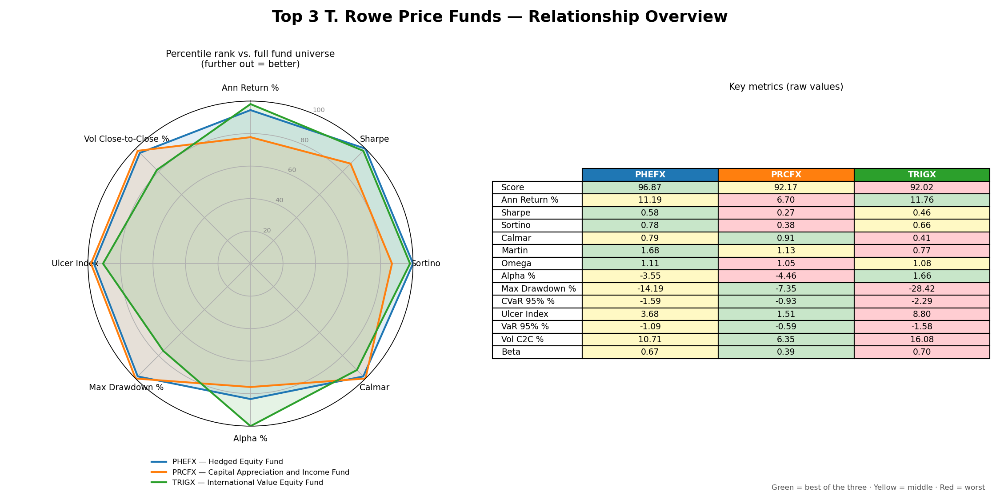
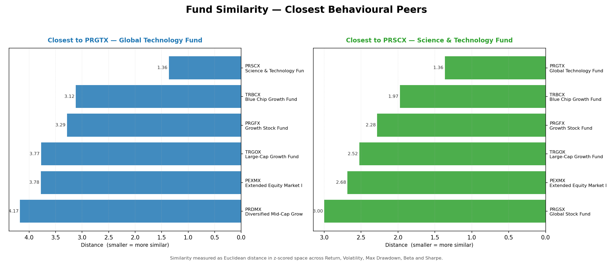
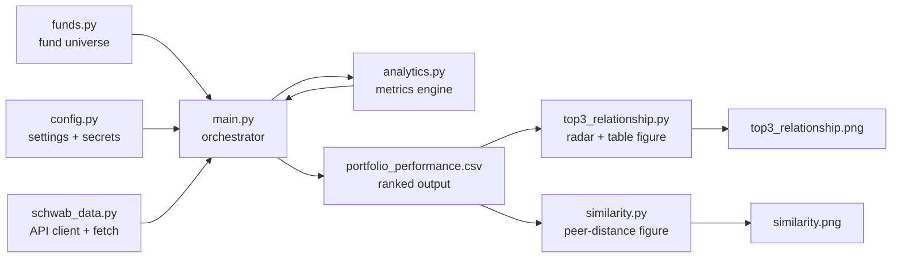

# Project Description

> A quantitative research tool that ranks T. Rowe Price equity mutual funds by
> risk-adjusted performance, pulling live market data from the Charles Schwab
> API and producing a csv file and two graphical summaries: a
> comparison of the best-scoring funds and a peer-similarity map.

---
> Note: This project was made using LLM's. Double check metrics calculations.
##

Running `python main.py` produces both figures below.

### Top-3 relationship overview



A radar (spider) chart comparing the three best-ranked funds across eight core
performance/risk dimensions, beside a colour-graded table of their raw metric
values (green = best of the three, yellow = middle, red = worst).

### Fund similarity — closest behavioural peers



For each target fund, a horizontal-bar panel ranks the funds that behave most
like it (shorter distance = more similar), measured across return, volatility,
drawdown, beta and Sharpe.

---

## 1. The problem we set out to solve

T. Rowe Price offers ~55 equity mutual funds spread across styles (large-cap,
mid/small-cap, international, sector, index, and hybrid). Picking between them by
eye is unreliable, because raw return says nothing about the **risk** taken to
earn it. The goal of this project is to answer one question objectively:

> *"Over a common look-back window, which funds delivered the best return for
> the least risk?"*

To do that we pull each fund's full daily price history, compute a standard set
of institutional performance and risk metrics, combine them into a single
composite score, and rank every fund from best to worst. The three top-ranked
funds are then visualized so the trade-offs between them are obvious at a glance.

---

## 2. What we expect to achieve

- **Objective ranking** — a reproducible, data-driven ordering of all funds
  instead of marketing-driven fund fact sheets.
- **Apples-to-apples comparison** — every fund is measured over the *same*
  trailing window (5 years by default) and against the *same* benchmark
  (`$SPX`), so scores are directly comparable.
- **Portable output** — a CSV that drops straight into Excel / Google Sheets,
  plus two publication-quality PNGs: a top-three comparison and a peer-similarity
  map.

---

## 3. How it works — the pipeline



1. **`main.py`** authenticates to Schwab, then loops over every fund in
   **`funds.py`**.
2. For each symbol it calls **`schwab_data.py`** to download daily price history
   (rate-limited to stay under Schwab's API cap).
3. Each price series is handed to **`analytics.py`**, which returns the full
   metric set.
4. `main.py` ranks all funds into a composite score and writes
   **`portfolio_performance.csv`**.
5. `main.py` then calls **`top3_relationship.py`** to render the graphical
   comparison of the three best funds (**`top3_relationship.png`**).
6. Finally `main.py` calls **`similarity.py`** to print the closest behavioural
   peers of the target funds and render **`similarity.png`**.

---

## 4. How to run it

```powershell
# 1. Install dependencies
pip install -r requirements.txt

# 2. Provide credentials
Copy-Item .env.example .env   # then edit .env with your Schwab app key/secret

# 3. Pull data, rank funds, and generate both figures
#    (first run opens a browser for OAuth consent)
python main.py
```

Outputs: `portfolio_performance.csv` (ranked table), `top3_relationship.png`
(comparison of the three best funds), and `similarity.png` (closest behavioural
peers of the target funds). The two figure scripts can also be run on their own
(`python top3_relationship.py`, `python similarity.py`) against an existing CSV.

---

