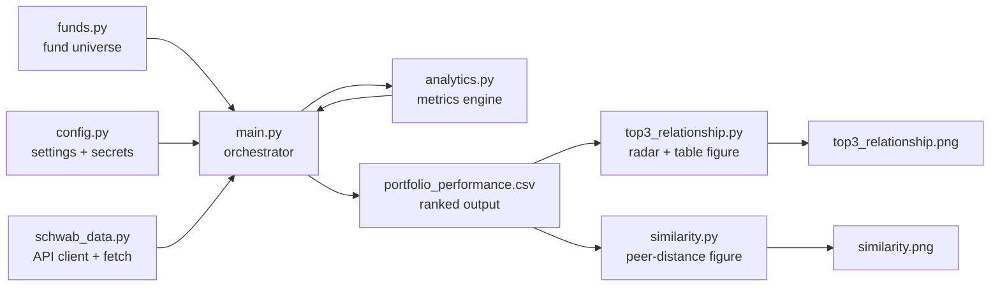

# Project Description

> A quantitative research tool that ranks T. Rowe Price equity mutual funds by
> risk-adjusted performance, pulling live market data from the Charles Schwab
> API and producing a csv file and two graphical summaries: a
> comparison of the best-scoring funds and a peer-similarity map.

---
> Note: This project was made using LLM's. Double check metrics calculations.
##

Running `python main.py` produces both figures below.

### Top-3 relationship overview


A radar (spider) chart comparing the three best-ranked funds across eight core
performance/risk dimensions, beside a colour-graded table of their raw metric
values (green = best of the three, yellow = middle, red = worst).

### Fund similarity — closest behavioural peers


For each target fund, a horizontal-bar panel ranks the funds that behave most
like it (shorter distance = more similar), measured across return, volatility,
drawdown, beta and Sharpe.

---

## 1. The problem we set out to solve

T. Rowe Price offers ~55 equity mutual funds spread across styles (large-cap,
mid/small-cap, international, sector, index, and hybrid). Picking between them by
eye is unreliable, because raw return says nothing about the **risk** taken to
earn it. The goal of this project is to answer one question objectively:

> *"Over a common look-back window, which funds delivered the best return for
> the least risk?"*

To do that we pull each fund's full daily price history, compute a standard set
of institutional performance and risk metrics, combine them into a single
composite score, and rank every fund from best to worst. The three top-ranked
funds are then visualized so the trade-offs between them are obvious at a glance.

---

## 2. What we expect to achieve

- **Objective ranking** — a reproducible, data-driven ordering of all funds
  instead of marketing-driven fund fact sheets.
- **Apples-to-apples comparison** — every fund is measured over the *same*
  trailing window (5 years by default) and against the *same* benchmark
  (`$SPX`), so scores are directly comparable.
- **Portable output** — a CSV that drops straight into Excel / Google Sheets,
  plus two publication-quality PNGs: a top-three comparison and a peer-similarity
  map.

---

## 3. How it works — the pipeline



1. **`main.py`** authenticates to Schwab, then loops over every fund in
   **`funds.py`**.
2. For each symbol it calls **`schwab_data.py`** to download daily price history
   (rate-limited to stay under Schwab's API cap).
3. Each price series is handed to **`analytics.py`**, which returns the full
   metric set.
4. `main.py` ranks all funds into a composite score and writes
   **`portfolio_performance.csv`**.
5. `main.py` then calls **`top3_relationship.py`** to render the graphical
   comparison of the three best funds (**`top3_relationship.png`**).
6. Finally `main.py` calls **`similarity.py`** to print the closest behavioural
   peers of the target funds and render **`similarity.png`**.

---

## 4. Technologies used and why

| Technology | Role | Why we chose it |
|---|---|---|
| **Python 3.13** | Implementation language | De-facto standard for quantitative/data work; rich ecosystem. |
| **pandas** | Time-series & tabular data | Effortless handling of indexed daily price series, ranking, and CSV export. |
| **NumPy** | Numerical math | Fast vectorized statistics (volatility, drawdowns, VaR/CVaR). |
| **schwab-py** | Schwab API client | Handles OAuth2 token refresh and price-history endpoints so we don't reimplement auth. |
| **httpx** | HTTP transport | Underlying request client with configurable timeouts (used by schwab-py). |
| **matplotlib** | Visualization | Produces the radar chart + colour-graded table figure without external services. |
| **.env + .gitignore** | Secret management | Keeps API keys and OAuth tokens out of source control. |

---

## 5. File-by-file walkthrough

### `main.py` — orchestrator / entry point
The conductor of the whole run. Responsibilities:
- Creates the Schwab client and fetches the benchmark (`$SPX`) history.
- Determines the common trailing window (`LOOKBACK_YEARS`) and slices every
  series to it so all funds share an identical measurement period.
- Iterates the fund universe, fetching data and computing metrics for each,
  while flagging funds with insufficient or partial history.
- `rank_frame()` builds the **composite score**: each metric is converted to a
  percentile rank across the universe (risk metrics inverted so lower risk
  scores higher), the ranks are averaged, scaled to 0–100, and sorted so the
  best fund is rank 1.
- Exports the ranked table to CSV and prints a condensed console view plus
  warnings about funds that failed or lack full coverage.

*Why:* keeps I/O, orchestration, ranking, and presentation in one place while
delegating the math to `analytics.py` and the networking to `schwab_data.py`.

### `analytics.py` — metrics engine
Pure, dependency-light functions that turn a daily NAV/close series into
institutional metrics. Grouped into:
- **Return:** annualized (geometric/CAGR) return.
- **Performance ratios:** Sharpe, Sortino, Calmar, Martin (Ulcer Performance
  Index), Omega, Treynor, and Jensen's Alpha (CAPM).
- **Risk:** max drawdown, Ulcer Index, historical VaR and CVaR (Expected
  Shortfall), close-to-close volatility, and Beta vs. the benchmark.
- `compute_all()` bundles every metric into one dictionary per fund.

*Why:* isolating the math makes it independently testable and reusable. Metrics
that require intraday OHLC (Parkinson, Garman-Klass, Rogers-Satchell,
Yang-Zhang) are deliberately reported as `N/A` because mutual funds only publish
a single daily NAV — we document that limitation rather than fabricate numbers.

### `schwab_data.py` — data access layer
- Builds the authenticated Schwab client via `schwab-py`'s `easy_client`
  (OAuth token is cached locally and auto-refreshed).
- `fetch_daily_history()` downloads maximum-available daily candles for a
  symbol, normalizes them into a clean date-indexed DataFrame, de-duplicates,
  drops non-positive prices, and retries transient network/empty-body errors.
- A sliding-window **rate limiter** (`_RateLimiter`) keeps request volume under
  Schwab's ~120 req/min ceiling.

*Why:* concentrating all network concerns (auth, retries, throttling, parsing)
here keeps the rest of the codebase pure and deterministic.

### `config.py` — central configuration & secret loading
- Loads a local, git-ignored `.env` file into the environment.
- Exposes API credentials (`CLIENT_ID`, `CLIENT_SECRET`, `REDIRECT_URI`) and the
  OAuth `TOKEN_PATH` — **never hard-coded**, always read from environment.
- Holds all analysis parameters in one place: risk-free rate, trading days
  (252), look-back window (5y), benchmark symbol, VaR confidence (95%), API
  throttle, and output paths.

*Why:* a single source of truth for tunable settings, and a clean boundary that
keeps secrets out of the repository.

### `funds.py` — the fund universe
An ordered list of `(symbol, name, category)` tuples covering the full T. Rowe
Price equity line-up, grouped by style (large-cap, mid/small-cap, international,
sector, index, hybrid).

*Why:* data, not code — editing the investable universe is a one-line change
with no impact on logic.

### `top3_relationship.py` — graphical relationship table
Reads the ranked CSV, selects the three best funds, and renders one figure with
two panels:
- **Radar (spider) chart** — each fund plotted across eight core dimensions;
  every axis is a 0–100 percentile rank relative to the *entire* fund universe
  (risk axes inverted so "further out" always means "better"). This shows the
  shape of each fund's strengths and weaknesses at a glance.
- **Colour-graded table** — the underlying raw metric values for the three
  funds, with each row shaded green/yellow/red for best/middle/worst so
  head-to-head trade-offs are immediately readable.

Output is saved as `top3_relationship.png`.

*Why:* a ranking table answers "which is best overall", but investors also need
to see *how* the leaders differ (e.g. one wins on return, another on drawdown).
The radar + table combination communicates that relationship visually.

### `similarity.py` — peer-distance explorer
Given one or more target funds, it z-scores the universe across return,
volatility, drawdown, beta, and Sharpe, then ranks every other fund by Euclidean
distance to find the closest behavioural peers. `print_report()` prints the
rankings to the console and `build_figure()` renders a horizontal-bar figure
(one panel per target) saved as `similarity.png`. Both are invoked automatically
at the end of a `main.py` run.

*Why:* useful for substitution/diversification research — "if I like fund X,
what behaves similarly?" — and the figure makes the closest matches obvious at a
glance.

### Supporting / generated files
- **`portfolio_performance.csv`** — the ranked output table (the product of a
  run). Spreadsheet-ready.
- **`top3_relationship.png`** — generated figure from `top3_relationship.py`.
- **`similarity.png`** — generated figure from `similarity.py`.
- **`requirements.txt`** — pinned minimum versions of the runtime dependencies.
- **`.env.example`** — template showing which environment variables to set;
  copy to `.env` and fill in your own Schwab credentials.
- **`.gitignore`** — excludes secrets (`.env`, `schwab_token.json`), caches, and
  transient output from version control.
- **`todo.md`** — the original requirements brief and the full fund list.
- **`run_output.txt` / `ping.txt`** — scratch/log artefacts from local runs
  (git-ignored).

---

## 6. How to run it

```powershell
# 1. Install dependencies
pip install -r requirements.txt

# 2. Provide credentials
Copy-Item .env.example .env   # then edit .env with your Schwab app key/secret

# 3. Pull data, rank funds, and generate both figures
#    (first run opens a browser for OAuth consent)
python main.py
```

Outputs: `portfolio_performance.csv` (ranked table), `top3_relationship.png`
(comparison of the three best funds), and `similarity.png` (closest behavioural
peers of the target funds). The two figure scripts can also be run on their own
(`python top3_relationship.py`, `python similarity.py`) against an existing CSV.

---

## 7. Design decisions & talking points

- **Composite percentile scoring** avoids letting any single metric or unit
  scale dominate — every metric contributes equally on a 0–1 rank basis.
- **A common window and benchmark** guarantee comparability; funds without full
  coverage are flagged rather than silently mixed in.
- **Honest `N/A`s** — intraday-only volatility estimators are not invented from
  daily NAV data; the limitation is documented.
- **Separation of concerns** — networking (`schwab_data`), math (`analytics`),
  configuration (`config`), data (`funds`), orchestration (`main`), and
  visualization (`top3_relationship`, `similarity`) are cleanly decoupled and
  independently testable.
- **Security first** — no credential ever lives in the source tree; everything
  sensitive is environment-loaded and git-ignored.
